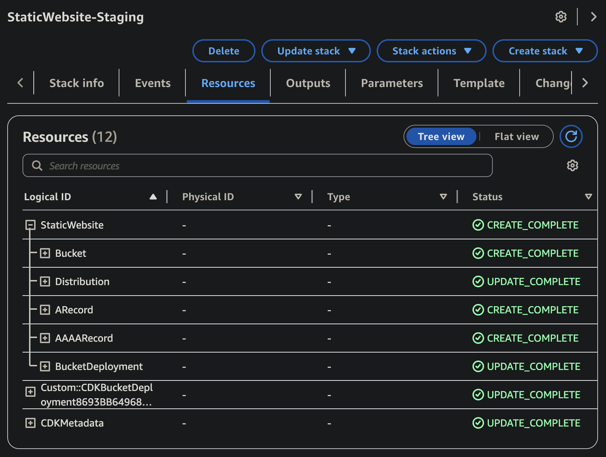

# Static Website on AWS

[English](README.md) | [中文](README.zh.md)

A TypeScript-based AWS CDK project for deploying static websites to AWS infrastructure. This project provides a robust and scalable solution for hosting static websites using AWS services.

## Features

- Automated infrastructure creation and continuous deployment using AWS CDK
- Environment-based deployment (staging and production)

## Prerequisites

- AWS Account
- AWS CLI installed ([Reference](https://docs.aws.amazon.com/cli/latest/userguide/getting-started-install.html#getting-started-install-instructions)) and configured with appropriate credentials ([Reference](https://docs.aws.amazon.com/cli/latest/userguide/getting-started-quickstart.html#getting-started-quickstart-new)). To try out quickly, I recommend to use CLI commands with long-term credentials:
  ```
  aws configure
  ```
- AWS CDK CLI installed globally ([Reference](https://docs.aws.amazon.com/cdk/v2/guide/getting-started.html#getting-started-install)):
  ```
  npm install -g aws-cdk
  ```

## Installation

1. Clone the repository:

```bash
git clone https://github.com/shuo-s-feng/static-website-on-aws.git
cd static-website-on-aws
```

2. Install dependencies:

```bash
yarn install
```

## Project Structure

```
.
├── bin/                    # CDK app entry points
├── src/                    # Source code
│   ├── constructs/        # Reusable CDK constructs
│   ├── stacks/           # CDK stacks
│   └── utils/            # Utility functions
├── examples/              # Example configurations
└── cdk.out/              # CDK synthesis output
```

## Environment Configuration

This project uses environment-specific configuration files to manage different deployment environments.

- Copy `.env.example` to `.env.staging` and/or `.env.prod` and fill in values
- The deployment commands will read the file based on `NODE_ENV`

## Lambda@Edge rewrite (optional)

- Enable path rewrite by setting `STATIC_WEBSITE_USE_LAMBDA_EDGE=true` in your `.env.*`.
- Behavior: rewrites extensionless paths at any depth during origin request, for example:
  - `/about` or `/about/` -> `/about.html`
  - `/articles/foo` or `/articles/foo/` -> `/articles/foo.html`
- Root `/` and requests with file extensions are not changed.

Notes:

- Lambda@Edge functions must be created in `us-east-1` and may take several minutes to replicate globally after deployment.
- Set `STATIC_WEBSITE_USE_LAMBDA_EDGE=false` to deploy without Lambda@Edge.

## Deployment

### Environment Setup

1. Create `.env.staging` and/or `.env.prod` from `.env.example`
2. Fill in the appropriate values for your AWS account and website configuration
3. If using a custom domain, provide a domain and optionally a certificate ARN

### Staging Environment

```bash
yarn deploy-web:staging
```

### Production Environment

```bash
yarn deploy-web:prod
```

Note: Make sure your AWS credentials are properly configured before deployment. The deployment process will use the environment-specific configuration from the respective `.env.*` file.

## Created AWS Resources

After deployment, the following resources will be created in your AWS account:

- **CloudFormation** - Centralized management of all AWS resources related to deployment
- **S3 Bucket** - Stores the static files of the website
- **CloudFront Distribution** - Global CDN with optional SSL certificate and custom domain configuration
- **A and AAAA records in Route 53 HostedZone** (optional) - Custom domain redirection to the created CloudFront domain

CloudFormation example screenshot:



You can access your website through:

- CloudFront domain (see stack outputs): `https://{distribution-domain-name}`
- Custom domain (if configured): `https://{your-domain-name}`
