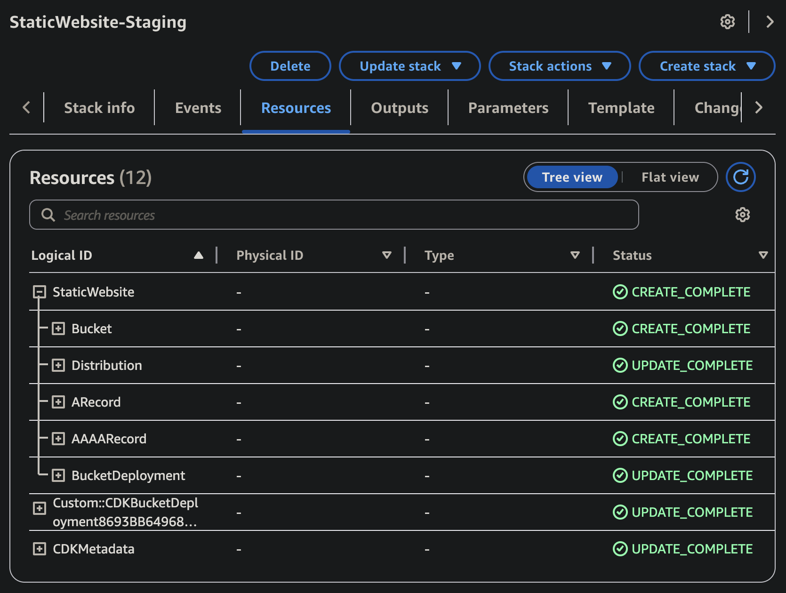

# AWS 静态网站部署

[English](README.md) | [中文](README.zh.md)

这是一个基于 TypeScript 的 AWS CDK 项目，用于将静态网站部署到 AWS 基础设施。该项目提供了一个强大且可扩展的解决方案，用于使用 AWS 服务托管静态网站。

## 功能特点

- 使用 AWS CDK 自动创建和持续部署基础设施
- 基于环境的部署（测试环境和生产环境）

## 前置要求

- 海外 AWS 账户
- 安装 AWS CLI（[参考文档](https://docs.aws.amazon.com/zh_cn/cli/latest/userguide/getting-started-install.html#getting-started-install-instructions)）并配置适当的凭证（[参考文档](https://docs.aws.amazon.com/zh_cn/cli/latest/userguide/getting-started-quickstart.html#getting-started-quickstart-new)）。为了快速尝试，我建议使用带有长期凭证（`Long-term credentials`）的 CLI 命令：
  ```
  aws configure
  ```
- 全局安装 AWS CDK CLI（[参考文档](https://docs.aws.amazon.com/zh_cn/cdk/v2/guide/getting-started.html#getting-started-install)）：
  ```
  npm install -g aws-cdk
  ```

## 安装步骤

1. 克隆仓库：

```bash
git clone https://github.com/shuo-s-feng/static-website-on-aws.git
cd static-website-on-aws
```

2. 安装依赖：

```bash
yarn install
```

## 项目结构

```
.
├── bin/                    # CDK 应用入口点
├── src/                    # 源代码
│   ├── constructs/        # 可重用的 CDK 构造
│   ├── stacks/           # CDK 堆栈
│   └── utils/            # 工具函数
├── examples/              # 示例配置
└── cdk.out/              # CDK 合成输出
```

## 环境配置

本项目使用特定于环境的配置文件来管理不同的部署环境。

- 复制 `.env.example` 为 `.env.staging` 和/或 `.env.prod` 并填写变量
- 部署命令会根据 `NODE_ENV` 读取对应的文件

## 部署

### 环境设置

1. 基于 `.env.example` 创建 `.env.staging` 和/或 `.env.prod`
2. 填写适合您 AWS 账户和网站配置的值
3. 如果使用自定义域名，提供域名并可选提供证书 ARN

### 测试环境

```bash
yarn deploy-web:staging
```

### 生产环境

```bash
yarn deploy-web:prod
```

注意：在部署之前，请确保您的 AWS 凭证已正确配置。部署过程将使用相应 `.env.*` 文件中的环境特定配置。

## 创建的 AWS 资源

部署后，以下资源将在您的 AWS 账户中创建：

- **CloudFormation** - 中心化管理部署相关的所有 AWS 资源
- **S3 Bucket** - 存储了网站的静态文件
- **CloudFront Distribution** - 全球 CDN，支持可选的 SSL 证书与自定义域名配置
- **Route 53 中的 A 和 AAAA 记录**（可选）- 自定义域名指向所创建的 CloudFront 域名

CloudFormation 示例截图：



您可以通过以下方式访问您的网站：

- CloudFront 域名（参见堆栈输出）：`https://{distribution-domain-name}`
- 自定义域名（如果已配置）：`https://{your-domain-name}`
